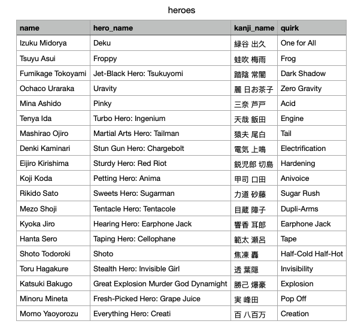
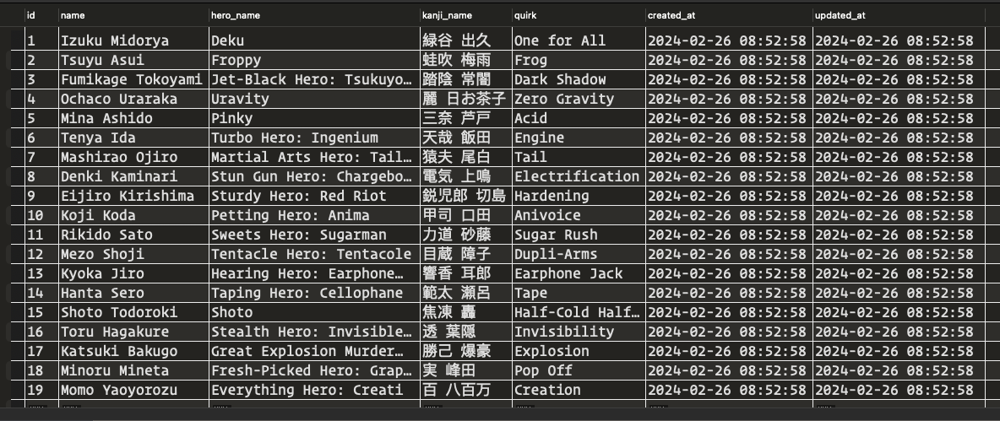

# Database Design

Today we are discussing Entity Relationship Diagrams (ERDs) and the fundamental principles of database design. In this session, we will explore the basics of Entity Relationship Diagrams (ERDs), MySQL data types, principles of database design, normalization, and the various types of relationships commonly found in database systems.

## MySQL
The database we will be using for this stack is MySQL, a relational database system. A relational database organizes data into one or more data tables in which data may be related to each other; these relations help structure the data.

### Tabular Format
We can use the concept of spreadsheets to help us visualize these data tables. Spreadsheets have columns and rows, just like a MySQL table.

Let's see what our heroes list might look like in a spreadsheet.

As we can see, each hero can be a row in a spreadsheet, and each hero shares the same columns. Furthermore, each column correlates to an attribute of our `Hero` class.

Now let's see what they might look like in a MySQL table.

We have added some columns, but the rest of the data is identical to the previous screenshot. Let's take a closer look at the added columns:

1. `id`: This column is known in MySQL as the *primary key*. The primary key column is a like a license plate for a car. No other row has the same `id`, just like no other car has the same license plate.

   It's a special column in a table that holds a unique value for each row, making it easy for the database to find and manage that row of information.

   This helps keep all the information organized and makes it faster for the database to find what you're looking for. Try to think of other IRL examples of *unique identifiers*.

2. `created_at`: This column keeps track of what date and time this row was added to the database.

## Entity Relationship Diagrams (ERDs)
An Entity Relationship Diagram (ERD) is a visual representation of the tables within a database and the relationships between them.

For those of you on Windows and Macs running Ventura or earlier, we will be using MySQL Workbench to design our databases and create ERDs.

For Macs running Sonoma (the latest MacOS), we will be using a VS Code extension called [ERD Editor](https://marketplace.visualstudio.com/items?itemName=dineug.vuerd-vscode).

**Components of ERDs:**
- Entities
- Attributes
- Relationships

Entities: Represent real-world objects such as people, places, or things.

Attributes: Characteristics or properties of entities.
Relationships: Connections between entities, depicting how they interact or associate with each other.
Notation: Crow’s Foot notation or Chen notation are commonly used to represent ERDs.