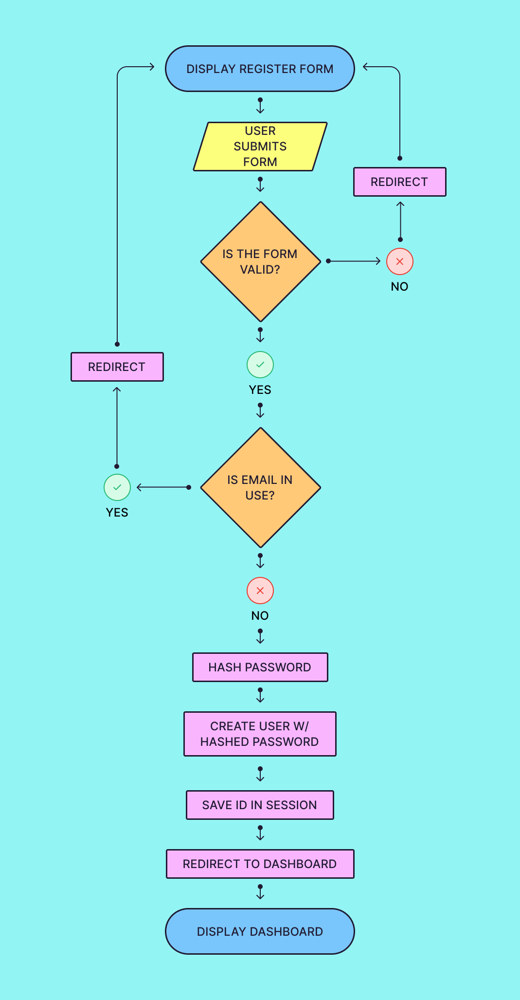

# Login-Reg
A guide to implementing login and registration features for your Flask application.

## Creating the ERD
Create the ERD for your `users` table as usual, but there is one thing to remember.

**Make sure the password column is long enough. It needs to have at least a 60-character limit.**

## Creating the `User` Class
Your `User` class will require two static methods and three class methods.

**Static Methods:**
1. A validation method for your registration form.
2. A validation method for your login form.

**Class Methods:**
1. A register method to create a `User` object. This is your SQL `INSERT` query.
2. A method that finds a user in the `users` table by `email`. This is used by both the login and register routes.
3. A method that finds a user in the `users` table by `id`. This is any routes that need to display the information of the currently logged-in user.

## Controller Methods
In your `users.py` controller, you'll need at least four routes:
1. A route to display the login and register forms
2. A route to process the register form
3. A route to process the login form
4. A route to log the user out

**Processing the register form:**
This is the route that will ultimately insert a new user into the database. Plan out the flow before diving in.

