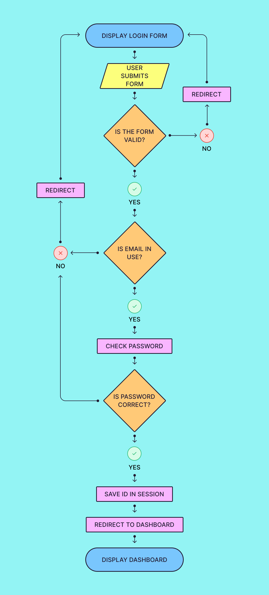

# Login-Reg
A guide to implementing login and registration features for your Flask application.

## Folder Structure
This assignment should be modularized. Here is the folder structure.

You may not have a CSS file if you're using Bootstrap or just not styling the assignment. If you don't, you can safely ignore the static folder.

You probably won't have any images or JavaScript files unless you're really going all out on the front end. If you do though, they would go in the static folder in appropriate sub-folders.
```
.
└── login-reg
    ├── users_erd.mwb
    ├── Pipfile
    ├── Pipfile.lock
    ├── flask_app
    │   ├── __init__.py
    │   ├── config
    │   │   └── mysqlconnection.py
    │   ├── controllers
    │   │   └── users.py
    │   ├── models
    │   │   └── user.py
    │   ├── static
    │   │   └── css
    │   │       └── style.css
    │   └── templates
    │       ├── dashboard.html
    │       └── index.html
    └── server.py
```

## Creating the ERD
Create the ERD for your `users` table as usual. Your table will have `id`, `first_name`, `last_name`, `email`, `password`, `created_at`, and `updated_at` columns.

**Make sure the password column is long enough. It needs to have at least a 256-character limit to accommodate the hash.**

## Creating the `User` Class
The attributes listed in your constructor will be the same as the columns in the database. Just use the same name for everything and make it easy on yourself.

You will require two static methods and three class methods.

**Static Methods:**
1. A validation method for your registration form.
2. A validation method for your login form.

**Class Methods:**
1. A register method to create a `User` object. This is your SQL `INSERT` query.
2. A method that finds a user in the `users` table by `email`. This is used by both the login and register routes.
3. A method that finds a user in the `users` table by `id`. This is for any routes that need to display the information of the currently logged-in user.

## Controller View Functions
In your `users.py` controller, you'll need at least four routes:
1. A route to display the login and register forms
2. A route to process the register form
3. A route to process the login form
4. A route to log the user out
5. A route to display the dashboard

**Processing the register form:**
This is the route that will ultimately insert a new user into the database. Plan out the flow before diving in.


**Processing the login form:**
This is the route that authenticates the user by checking if the user exists and verifying their password. Plan out the flow before diving in.

